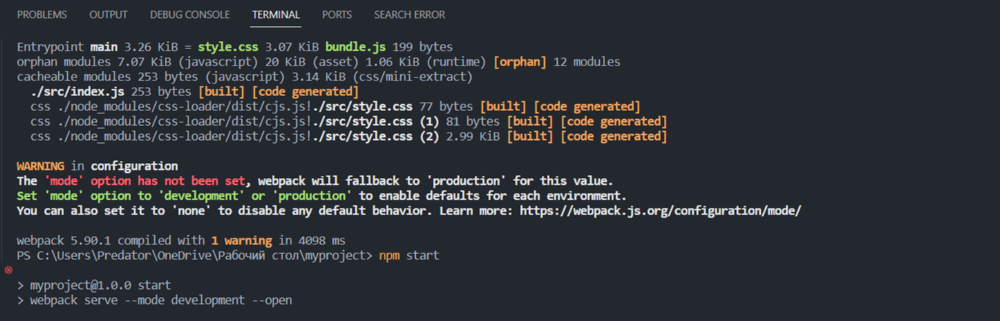
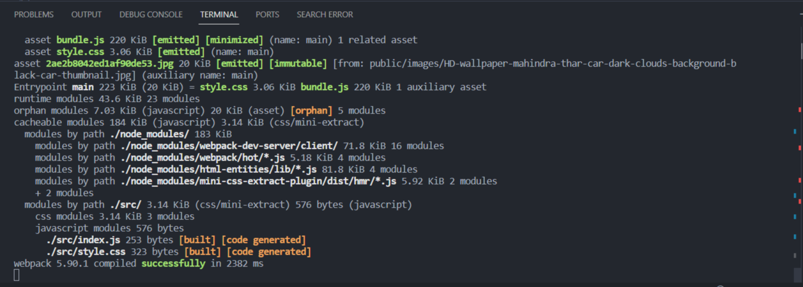

Документация проекта
Структура проекта
Проект организован следующим образом:
Myproject/
│
├── src/                    # Исходные файлы проекта
│   ├── index.html          # HTML файл главной страницы
│   ├── index.js            # JavaScript файл для главной страницы
│   ├── style.css           # CSS файл для главной страницы
│   ├── about.html          # HTML файл страницы "О нас"
│   ├── style2.css          # CSS файл для страницы "О нас"
│   ├── about.js            # JavaScript файл для страницы "О нас"
│   ├── contact.html        # HTML файл страницы "Контакты"
│   ├── style3.css          # CSS файл для страницы "Контакты"
│   └── contact.js          # JavaScript файл для страницы "Контакты"
│
├── public/                 # Публичные файлы проекта
│   └── images/             # Изображения
│       └── photo1.jpg      # Пример изображения
│       └── photo2.jpg      # Пример изображения
│       └── ...             # Другие изображения
│
├── dist/                   # Скомпилированные файлы, создаваемые Webpack
│
├── node_modules/           # Зависимости проекта
│
├── package.json            # Файл конфигурации npm
│
└── webpack.config.js       # Файл конфигурации Webpack

Проект использует следующие основные зависимости:

Webpack: Мощный инструмент для сборки и управления модулями JavaScript.
Babel: Транспилятор JavaScript, позволяющий использовать современные возможности языка и поддерживать совместимость с более старыми браузерами.
Webpack Dev Server: Встроенный сервер для разработки с функцией перезагрузки при изменении файлов.
CSS Loader и Style Loader: Позволяют импортировать CSS файлы прямо в JavaScript код и добавлять стили в сгенерированный HTML.

Настройки Webpack
Вот пример конфигурации Webpack (webpack.config.js), дополненный настройками для установки HTMLWebpackPlugin и MiniCssExtractPlugin:

const path = require('path');
const HtmlWebpackPlugin = require('html-webpack-plugin');
const MiniCssExtractPlugin = require('mini-css-extract-plugin');

module.exports = {
  entry: './src/index.js',
  output: {
    path: path.resolve(__dirname, 'dist'),
    filename: 'bundle.js',
  },
  module: {
    rules: [
      {
        test: /\.js$/,
        exclude: /node_modules/,
        use: {
          loader: 'babel-loader',
          options: {
            presets: ['@babel/preset-env'],
          },
        },
      },
      {
        test: /\.css$/,
        use: [MiniCssExtractPlugin.loader, 'css-loader'],
      },
      {
        test: /\.(png|svg|jpg|jpeg|gif)$/i,
        type: 'asset/resource',
      },
    ],
  },
  plugins: [
    new HtmlWebpackPlugin({
      template: './src/index.html', 
      filename: 'index.html', 
    }),
    new HtmlWebpackPlugin({
      template: './src/about.html', 
      filename: 'about.html', 
    }),
    new HtmlWebpackPlugin({
      template: './src/contact.html', 
      filename: 'contact.html', 
    }),
    
    new MiniCssExtractPlugin({
      filename: 'style.css',
    }),
  ],
};

Инструкции по установке
Для установки зависимостей проекта выполните следующую команду в терминале:

npm install  # пишите определенный плагин или зависимость

Инструкции по запуску проекта
Чтобы запустить проект, выполните следующую команду:

npm run start

Дополнительные настройки Webpack
Вам также может понадобиться добавить дополнительные настройки Webpack в файл webpack.config.js, в зависимости от специфики вашего проекта.

Примеры использования
Примеры использования и функциональности проекта могут быть найдены в исходных файлах в папке src/.

Оптимизация проекта
Проект был оптимизирован с использованием следующих инструментов:

TerserWebpackPlugin: Плагин для минификации JavaScript кода.
OptimizeCssAssetsWebpackPlugin: Плагин для минификации и оптимизации CSS файлов.

Показатели оптимизации
Для проверки эффективности оптимизации, сравните следующие результаты:

 #проект запускается 4 секунд
 #проект запускается за 2.3 секунды

Добавление плагинов для оптимизации:

new MiniCssExtractPlugin({
      filename: 'style.css',
    }),
  ],
  optimization: {
    minimize: true,
    minimizer: [
      new TerserPlugin(),
      new OptimizeCssAssetsPlugin(),
    ],
  },
};

Ссылки на дополнительные ресурсы
Документация Webpack  --- # [text](https://webpack.js.org/concepts/)
Webpack плагины ---  # [text](https://webpack.js.org/plugins/)

